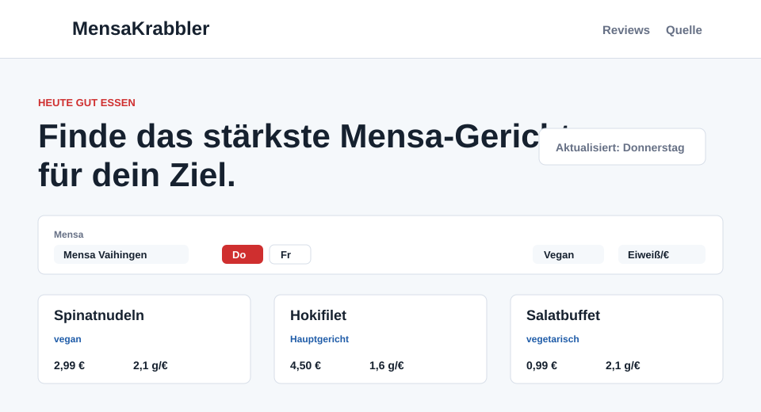

# MensaKrabbler

[](https://github.com/TomEbert/MensaKrabbler/actions/workflows/update-site.yml)

MensaKrabbler ist eine statische Website für den Speiseplanvergleich der Mensen **Stuttgart-Vaihingen** und **Central**. Die Seite zeigt Studierendenpreise, Nährwerte pro 100 g sowie die abgeleiteten Kennzahlen Eiweiß/€ und kcal/€.

Live: <https://mensakrabbler.tomebert.de/>



## Funktionen

- Auswahl zwischen Mensa Vaihingen und Mensa Central
- Tagesauswahl für Montag bis Freitag der aktuellen Woche, am Wochenende automatisch für die kommende Woche
- Filter für alle, vegetarische und vegane Gerichte
- Sortierung nach Eiweiß/€, Eiweiß pro 100 g, kcal/€, Preis oder Kalorien pro 100 g
- Tabellenansicht als Standard mit sortierbaren Spalten sowie umschaltbare Kartenansicht mit Preis, Nährwerten, CO2-Wert und Kategorien
- Transparenter Gesundheits-Orientierungswert von 0 bis 100 aus Eiweiß, Energiedichte, Zucker, Salz, Fett und gesättigten Fettsäuren
- Warnung in der Oberfläche, wenn die Daten älter als 36 Stunden sind
- Täglicher automatischer Abruf per GitHub Actions um 06:17 Uhr Europe/Berlin

## Lokale Entwicklung

```bash
python -m pip install -r requirements.txt
python MensaKrabblerWochenZieher.py
python -m http.server 8000
```

Danach ist die Seite lokal unter <http://localhost:8000/> erreichbar.

Tests:

```bash
python -m pytest
```

## Datenfluss

`MensaKrabbler.py` ruft die Quelle des Studierendenwerks Stuttgart ab, parst die Speiseplandaten und schreibt eine normalisierte JSON-Datei nach `Website/data/menu.json`. `index.html`, `Website/script.js` und `Website/stylesheet.css` bilden daraus die Website im Browser.

Die unterstützten Standorte sind:

| Standort | Quell-ID |
| --- | ---: |
| Mensa Vaihingen | `2` |
| Mensa Central | `16` |

Die Preise in der Oberfläche sind Studierendenpreise. Nährwerte beziehen sich auf 100 g, CO2 auf die in der Quelle angegebene Portion. Eiweiß/€ und kcal/€ werden aus den 100-g-Werten und dem Studierendenpreis berechnet.

## Automatisierung

Der Workflow `.github/workflows/update-site.yml` läuft täglich, manuell per `workflow_dispatch` und bei Änderungen am Website- oder Daten-Code. Der Ablauf ist:

1. Abhängigkeiten installieren
2. Tests ausführen
3. Speisepläne für beide Mensen abrufen
4. JSON validieren und committen
5. GitHub-Pages-Artefakt veröffentlichen

Wenn Abruf, Parser oder Tests fehlschlagen, wird kein neuer Stand veröffentlicht. Die letzte funktionierende GitHub-Pages-Version bleibt online.

## Legacy-Dateien

`MensaKrabblerGUI.py` und `MensaKrabbler.ipynb` bleiben im Repository, sind aber nicht mehr der empfohlene Weg für die Website. Der kompatible Python-Einstieg `MensaKrabbler.run(...)` existiert weiterhin.

## Quellen

- Speiseplandaten: <https://www.studierendenwerk-stuttgart.de/essen/speiseplan>
- Eingebetteter Speiseplan: <https://sws2.maxmanager.xyz/>
